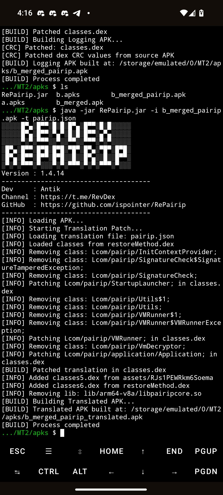
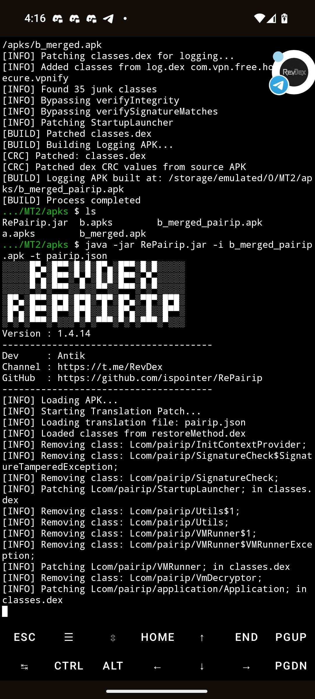

<p align="center">
  
</p>

<h1 align="center">RePairip</h1>

<p align="center">
  A Java reverse engineering utility for analyzing and rebuilding Android APK/APKS packages that use Google Play Google加固 protection.
</p>

<p align="center">
  <b>Current version:</b> 1.4.14 &nbsp;|&nbsp;
  <b>Language:</b> Java 17 &nbsp;|&nbsp;
  <b>Build:</b> Gradle + Shadow Jar
</p>


## Overview

RePairip is a command-line tool that works with PairIP-protected Android packages. It can merge split `.apks` packages, patch PairIP-related dex code, clean split metadata from the manifest, rebuild the APK, and optionally apply a static translation JSON to restore dumped PairIP values

## Tutorial

[▶ Watch Video on Telegram](https://t.me/RevDex/557)

## Tutorial <table align="center"> <tr> <td align="center" width="300"> <b>TreeView</b><br> <video src="https://revdex.re/input.mp4" width="100%" height="600" controls></video> </td> </tr> </table>


| App UI | Dump Style |
| --- | --- |
|  |  |


## License

This project is distributed under the Apache License 2.0.

```text
Apache License
Version 2.0, January 2004
https://www.apache.org/licenses/
```

Copyright (C) 2026 HighCapable
